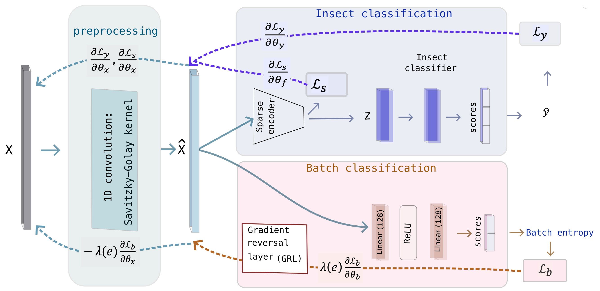

# BISN: Batch-Invariant Spectral Network

**Batch-Invariant Spectral Intelligence for Robust and Explainable Insect Authentication**

> Majharulislam Babor, Giacomo Rossi, Annalisa Altavilla, Oliver Schlüter, Marina M.-C. Höhne;
>
> 
> Leibniz Institute for Agricultural Engineering and Bioeconomy (ATB), Potsdam, Germany

---

## Overview

BISN is an end-to-end deep learning framework for batch-robust and interpretable
classification of edible insect species from near-infrared (NIR) reflectance spectra.
It addresses the core challenge of cross-batch generalisation: spectral variation
introduced by different production batches, instrument drift, and processing
treatments (blanching, plasma-activated water, ultrasound) causes standard models
to fail on unseen batches.



BISN achieves this through four jointly optimised components:

1. **Informed Preprocessing Module** — a Savitzky-Golay-initialised learnable 1D
   convolution followed by per-spectrum instance normalisation, which suppresses
   batch-induced spectral artefacts before feature extraction.
2. **Sparse Attentive Encoder** — an encoder with sparsemax masking that
   selects a compact, biochemically interpretable set of wavelength regions.
3. **Species Classifier** — a single linear layer ensuring all non-linear
   discriminative capacity is encoded in the latent representation.
4. **Entropy-Regularised Batch Discriminator** — connected to the preprocessing
   module via a Gradient Reversal Layer (GRL); maximises uncertainty over batch
   identity, driving the learned representation toward batch invariance.

The joint training objective is:
L = L_y + λ(e) · L_b + β · L_s


where `L_y` is the species cross-entropy, `L_b` is the negative Shannon entropy
of batch predictions, `L_s` is the TabNet sparsity regularisation, and `λ(e)` is
annealed from 0 to 1 using the DANN sigmoid schedule.

---

## Dataset

- **Species**: *Acheta domesticus*, *Hermetia illucens*, *Tenebrio molitor*
- **Batches**: 3 independent production batches per species (purchased at 30–60 day intervals)
- **Treatments**: T0 (tap water), T1 (blanching at 70°C), T2 (plasma-activated water)
- **Ultrasound**: U0 (none), U1 (applied)
- **Total spectra**: 2,700 (50 per factorial cell)
- **Spectral range**: 700–2050 nm at 10 nm intervals (136 wavelength variables)
- **Instrument**: PerkinElmer Lambda 950 UV-Vis/NIR, front-face reflectance mode

The dataset is not publicly distributed. For access inquiries, contact the
corresponding author.

---

## Requirements

```bash
Python >= 3.8
torch >= 1.13
pytorch-tabnet >= 3.1
numpy
pandas
scipy
scikit-learn
```

Install dependencies:

```bash
pip install torch pytorch-tabnet numpy pandas scipy scikit-learn
```

---

## Repository Structure
```bash
bisn/
├── assets/                 # Supporting documentation and figures
│   ├── architecture.png
│   ├── lobo_performance.png
│   └── attribution_analysis.png
├── data/                   # Raw data storage
├── outputs/                # Preprocessing configs, BISN embeddings
├── results/                
├── src/                    # Core source code
│   ├── dataloader.py       # Data ingestion and stream handling        
│   ├── main.py             # BISN model architecture and training logic  
│   └── preprocessing.py    # Spectral transformation and feature engineering
├── trained_model/          # Model checkpoints
├── README.md
└── requirements.txt
```


---

## Usage

### Single LOBO Fold

Leave out batch index `1` (0-based), train on the remaining two batches,
evaluate on the held-out batch:

```bash
python src/main.py --mode raw --b_out 1 --device cuda:0 --save_dir ./trained_model
```

**Arguments:**

| Argument | Default | Description |
|---|---|---|
| `--mode` | `raw` | `raw`: use raw spectra with learnable preprocessing; `preprocessed`: apply external classical preprocessing first |
| `--b_out` | `1` | Batch index to hold out (0-based integer) |
| `--device` | `cuda:0` | Compute device (`cuda:0`, `cuda:1`, `cpu`) |
| `--save_dir` | `./trained_model` | Output directory for model weights and training history |

### Full LOBO Cross-Validation

To run all three folds, wrap the call in a shell loop:

```bash
for fold in 0 1 2; do
    python bisn.py --mode raw --b_out $fold --device cuda:0 --save_dir ./trained_model
done
```

---

## Model Parameters

Key hyperparameters are defined in `model_params` inside `main()`:

| Parameter |  Description |
|---|---|
| `n_d` |  Embedding dimension |
| `n_a` |  Attention embedding dimension |
| `n_steps` |  Number of decision steps |
| `MAX_EPOCHS` | Maximum training epochs per fold |
| `BATCH_SIZE` | Mini-batch size |
| `LR` | Adam learning rate |
| `LAMBDA_MAX` Maximum adversarial weight (annealed) |
| `BETA` | Sparsity regularisation weight (β in Eq. 1) |
| `ALPHA` | Composite score weight: `α · val_acc + (1-α) · norm_entropy` |

---

## Outputs

For each LOBO fold, the following files are saved to `--save_dir`:

- `BISN_LOBO_{batch}.pt` — best model weights (selected on composite validation score)
- `BISN_history_LOBO_{batch}.csv` — per-epoch training history with columns:
  `epoch, val_acc, batch_acc, norm_entropy, composite_score, train_loss, val_loss`

